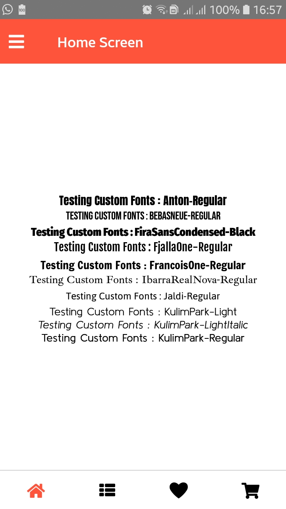
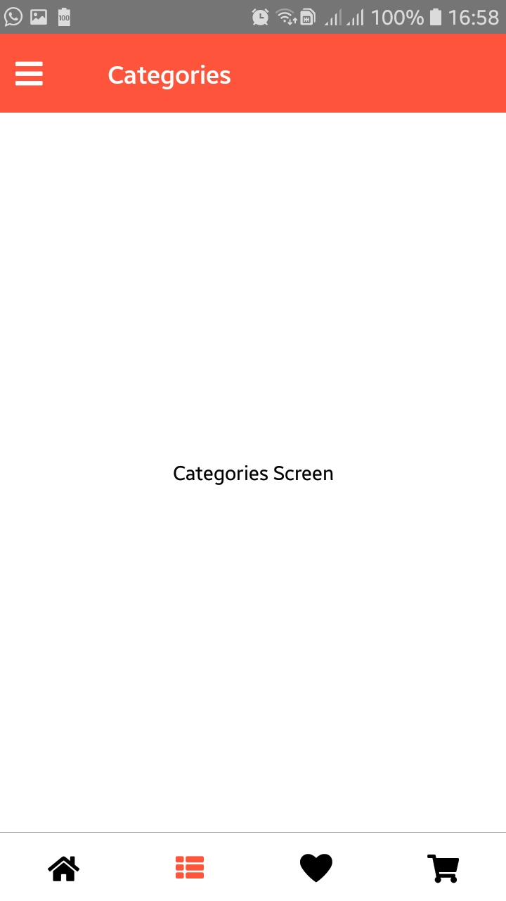
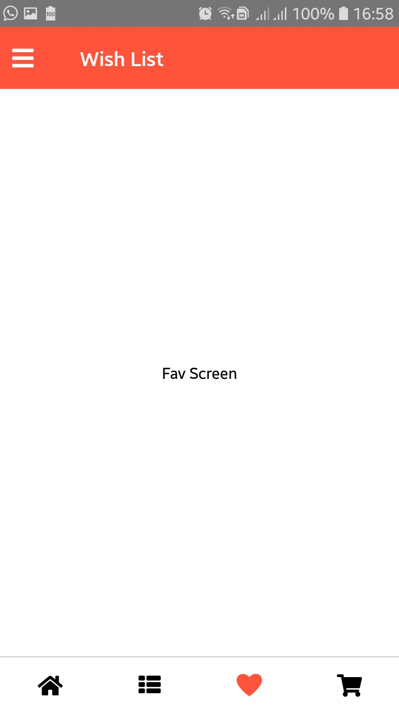
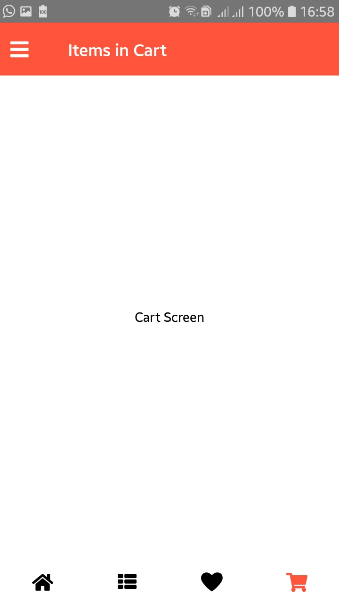
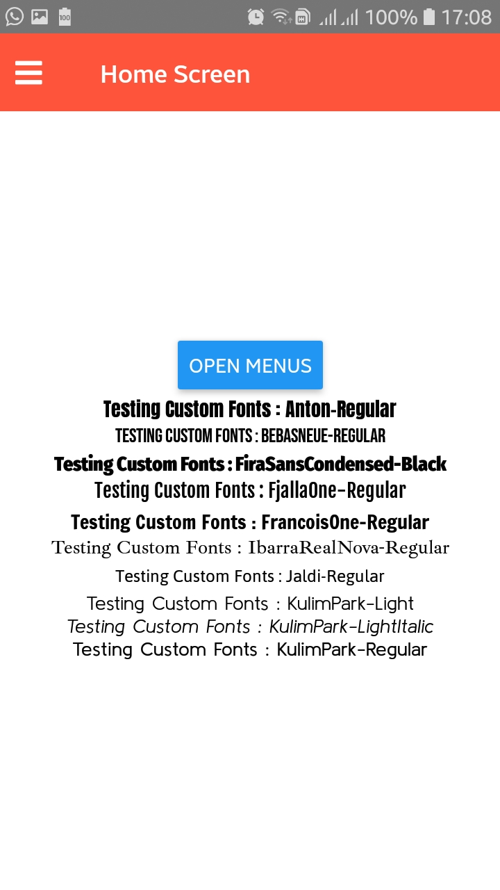
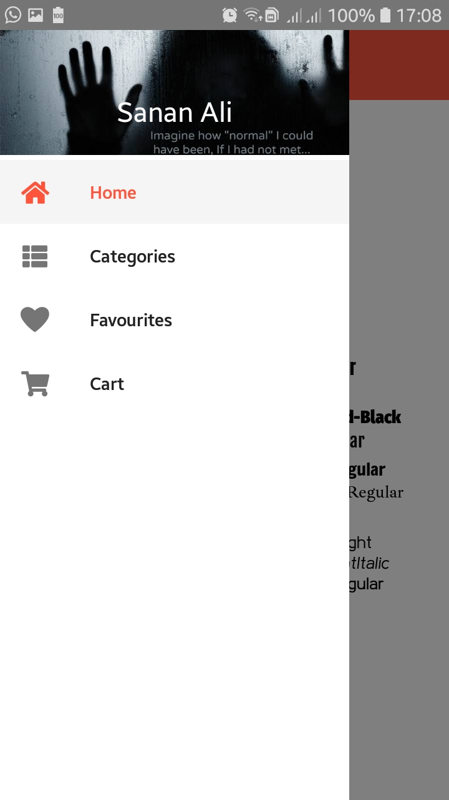
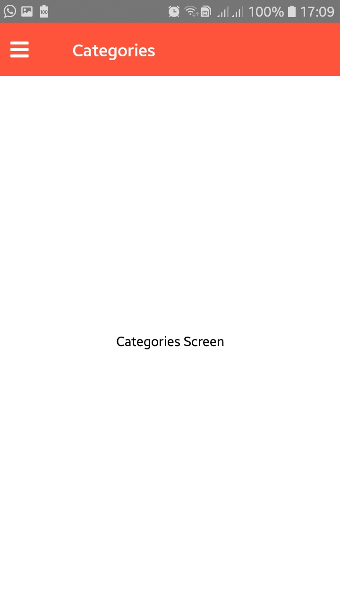

# React-Native-Templates
Various Templates for React Native App that will help you to save time in setting up the initial app. Check branches for different templates.

# BottomTabNavigator

     
     

# SideBarDrawerNavigator

     
     
